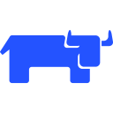

## こんにちは I'm NaClNeZn 👋

- 😄 A full stack developer.
- 🌱 Main development direction Java & Python.
- 🥵 Every technology is to solve problems, so I like to dabble in any technology.
- ✍️ Blogger.
- 🔭 I’m currently working on AI.
- 🍻 Love ACGN

### Languaues and Tools

    
    
    
    
    
    
    
    
    
    
    
    
    
    
    
    
    
    
    
    
    
    
    
    
    
    
    
    
    
    
    
    
    
    
    
    
    
    
    
    
    
    
    
    
    
    
    
    
    
    
    
    
    
    
    
    
    
    
    
    
     
    
    
    
    
    
    
    
    
    
    
    
    
    
    
    
    
    
    
    
    
    
    
    
    
    
    
    
    
    
    
    
    
    
    
    
    
    
    
    
    
    
    
    
    
    
    
    
    
    
    

### My GitHub Stats

   
  

